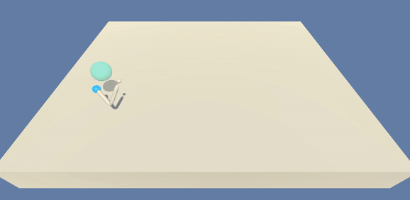
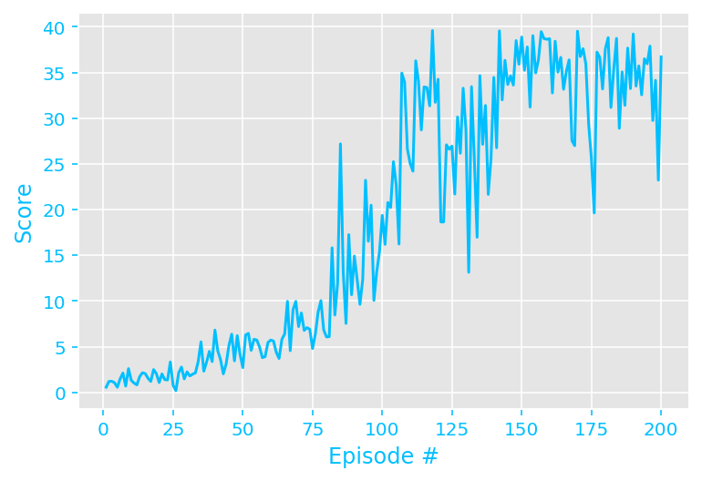
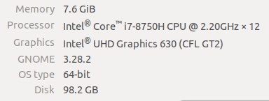

# Project 2 : Reacher Project (Continuous Control)

## Project's goal

In this environment, a double-jointed arm can move to target locations. A reward of +0.1 is provided for each step that the agent's hand is in the goal location. Thus, **the goal of the agent is to maintain its position at the target location for as many time steps as possible.**



## Environment details

The environment is based on [Unity ML-agents](https://github.com/Unity-Technologies/ml-agents).

> The Unity Machine Learning Agents Toolkit (ML-Agents) is an open-source Unity plugin that enables games and simulations to serve as environments for training intelligent agents. Agents can be trained using reinforcement learning, imitation learning, neuroevolution, or other machine learning methods through a simple-to-use Python API. 

The observation space consists of 33 variables corresponding to position, rotation, velocity, and angular velocities of the arm. Each action is a vector with four numbers, corresponding to torque applicable to two joints. Every entry in the action vector should be a number between -1 and 1.

- Set-up: Double-jointed arm which can move to target locations.
- Goal: The agents must move it's hand to the goal location, and keep it there.
- Agents: The Unity environment contains 20 agent linked to a single Brain.
  - The provided Udacity agent versions are Single Agent or 20-Agents
- Agent Reward Function (independent):
  - +0.1 Each step agent's hand is in goal location.
- Brains: One Brain with the following observation/action space.
  - Vector Observation space: 26 variables corresponding to position, rotation, velocity, and angular velocities of the two arm Rigidbodies.
  - Vector Action space: (Continuous) Size of 4, corresponding to torque applicable to two joints.
  - Visual Observations: None.
- Reset Parameters: Two, corresponding to goal size, and goal movement speed.
- Benchmark Mean Reward: 30

The environment is considered to be solved if the agents get an average score of +30 (over 100 consecutive episodes, and over all agents).

This implementation is **the solution of the First version of the environment (Single Agent)** using the off-policy **DDPG algorithm.** The task is episodic, and **in order to solve the environment, the agent must get an average score of +30 over 100 consecutive episodes.**


## Agent Implementation

### Deep Deterministic Policy Gradient (DDPG)

This project implements an *off-policy method* called **Deep Deterministic Policy Gradient** (DDPG) [Continuous control with deep reinforcement learning](https://arxiv.org/abs/1509.02971). 

> We adapt the ideas underlying the success of Deep Q-Learning to the continuous action domain. We present an actor-critic, model-free algorithm based on the deterministic policy gradient that can operate over continuous action spaces. Using the same learning algorithm, network architecture and hyper-parameters, our algorithm robustly solves more than 20 simulated physics tasks, including classic problems such as cartpole swing-up, dexterous manipulation, legged locomotion and car driving. Our algorithm is able to find policies whose performance is competitive with those found by a planning algorithm with full access to the dynamics of the domain and its derivatives. We further demonstrate that for many of the tasks the algorithm can learn policies end-to-end: directly from raw pixel inputs.


### Algorithm

DDPG is an algorithm which concurrently learns a Q-function and a policy. It uses off-policy data and the Bellman equation to learn the Q-function, and uses the Q-function to learn the policy. For more information visit [Deep Deterministic Policy Gradient](https://spinningup.openai.com/en/latest/algorithms/ddpg.html).


### Code implementation

The code used here is derived from the "DDPG bipedal" example in the Udacitys official repository [ddpg-bipedal](https://github.com/udacity/deep-reinforcement-learning/tree/master/ddpg-bipedal), and has been slightly adjusted for being used with the reacher environment.

The code is written in Python 3.6 and is relying on PyTorch 1.10.2 framework.

The code consist of :

- `model.py` : Implement the **Actor** and the **Critic** classes.
    - The Actor and Critic classes each implements a *Target* and a *Local* Neural Networks used for the training.
    
- `ddpg_agent.py` : Implement the **DDPG agent** and a **Replay Buffer memory** used by the DDPG agent.
    - The Actor's *Local* and *Target* neural networks, and the Critic's *Local* and *Target* neural networks are instanciated by the Agent's constructor
    - The `learn()` method updates the policy and value parameters using given batch of experience tuples.
        ```
        Q_targets = r + γ * critic_target(next_state, actor_target(next_state))
        where:
            actor_target(state) -> action
            critic_target(state, action) -> Q-value
        ```
  
- `Continuous_Control.ipynb` : This Jupyter notebooks allows to instantiate and train the agent. More in details it allows to :
  - Prepare the Unity environment and Import the necessary packages 
  - Check the Unity environment
  - Define a helper function to instantiate and train the agent
  - Explore - evaluate the Hyperparameters
  - Train the final agent
  - Plot the score results

### DDPG parameters and results

#### Methodology

This implementation can be divided into 4 parts:

- first: the agent was trained using the default code from the [example](https://github.com/udacity/deep-reinforcement-learning/tree/master/ddpg-bipedal). The results of this first test were not satisfactory, so I made changes to the code.

- second: I added new processing stages to the neural networks, such as batch normalization and leaky_relu. In the end, only the batch normalization was used.

- third: the hyperparameters were modified and several tests were carried out analyzing the results.

- fourth: a set of hyperparameters was chosen and the final model is trained.

From the previous methodology it is important to highlight 3 points:
- The parameters that most influenced the training were the size of the network (smaller networks gave better results), the learning rate of the networks and the noise sigma.
- The environment in unity restarts in 1000 iterations, so a number equal to or less than 1000  must be chosen for max_t at each training epoch.
- 100 iterations were chosen for the hyperparameters evaluation, having as a baseline the approximately 200 iterations that were needed in the [benchmark implementation](https://learn.udacity.com/nanodegrees/nd893/parts/f0b328e5-de4f-4a4e-a788-a9965fc2692a/lessons/66375d73-93e2-4be9-83e8-c9a5432a1c1e/concepts/0aecd385-b44f-4a56-bf59-5ed9697faaad) seen in the course. However, this is not a robust way of evaluating hyperparameters, since a larger range of hyperparameters has not been explored, and the agent can start learning in iterations greater than 100.

#### DDPG parameters

The final version of the DDPG agent uses the following parameters values:

```
state_size = 33         # environment State size 
action_size = 4         # environment Action size

buffer_size = int(1e5)  # replay buffer size
batch_size = 128        # minibatch size

gamma = 0.99            # discount factor
tau = 1e-3              # for soft update of target parameters

lr_actor = 2e-4         # learning rate of the actor 
lr_critic = 2e-4        # learning rate of the critic
weight_decay = 0        # L2 weight decay

actor_fc1_units = 128   # Number of units for the layer 1 in the actor model
actor_fc1_units = 128   # Number of units for the layer 2 in the actor model
critic_fcs1_units = 128 # Number of units for the layer 1 in the critic model
critic_fc2_units = 128  # Number of units for the layer 2 in the critic model
bn_bool = True             # Use Batch Norm

mu = 0.                 # noise parameter
theta = 0.15            # noise parameter
sigma = 0.1             # noise parameter
```
             
The **Actor Neural Networks** use the following architecture :

```
Input nodes (33) 
  -> Fully Connected Layer (128 nodes, Relu activation) 
    -> Batch Normlization
      -> Fully Connected Layer (128 nodes, Relu activation) 
         -> Ouput nodes (4 nodes, tanh activation)
```
     
       

The **Critic Neural Networks** use the following architecture :

```
Input nodes (33) 
  -> Fully Connected Layer (128 nodes, Relu activation) 
    -> Batch Normlization
      -> Include Actions at the second fully connected layer
        -> Fully Connected Layer (128+4 nodes, Relu activation) 
          -> Ouput node (1 node, no activation)
```

Both Neural Networks use the Adam optimizer with a learning rate of 2e-4 and are trained using a batch size of 128.

#### Results

Given the chosen architecture and parameters, the results are :

    Start training:
    Episode 100	Average Score: 6.00	Score: 19.37
    Environment solved in 200 episodes with an Average Score of 31.67



**These results meets the project's expectation as the agent is able to receive an average reward (over 100 episodes) of at least +30, and in 300 episodes only** 


### Ideas for future work
- For the single agent implementation, Would be interesting to:
    - use [Prioritized experience replay](https://arxiv.org/abs/1511.05952)
    - use more epochs. I notice that my agent has problems when the ball is rotating clockwise. Then, more training epochs coud be a good idea to avoid this situation.
  
- The next big step to this project would be to train the 20-agents version. In that case, it might be better to use another algorithm like [TRPO](https://arxiv.org/abs/1604.06778), [A3C](https://arxiv.org/pdf/1602.01783.pdf), and [D4PG](https://openreview.net/pdf?id=SyZipzbCb) that use multiple (non-interacting, parallel) copies of the same agent to distribute the task of gathering experience.  


### Misc : Configuration used 

This agent has been trained on a local PC with Ubuntu 18.04.6




### Video

https://youtu.be/LjDHi-eN_J0
